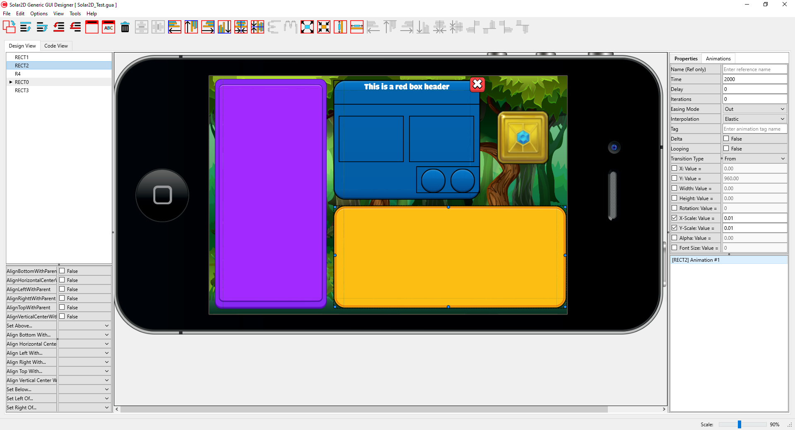

> Picture of the editor in use.

# Solar2DGUI
 A generic Solar2D GUI designer

This software is in the early stages of development. It is usable in its current
state. 

# Building Solar2DGUI
Embarcadero's C++ Builder 10.4 Free Community version is used to build a working version of this
program for windows. There is built in support for MAC, but not yet tested as I do not own a MAC.

Feel free to modify this program to fit your needs. I will monitor any and all pull requests
and attempt to update the source accordingly.

# Purpose
As a new to Solar2D developer, I found it rather difficult at times to design a simple
GUI for the games I develop. Constantly changing values and testing in the simulator became a tedious task.
As I build upon this program, I aim to make tasks easier for developers by providing a utility to allow
visual designing and animation testing. Animations are supported, but are limited. All designs can be
exported to any project folder. All exported files will be '<b>[Project Name].lua</b>' 

Any image files used within the editor will be copied to a subdirectory named '<b>assets</b>' within the
chosen project directory. If the files already exist in said directory, then they will NOT be overwritten.

# Contributing
If you are willing to improve Solar2DGUI by contributing code, by all means, fork this repository and create a pull request with any desired improvements.

# Creator
Solar2DGUI is maintained by me, John, I can be found
under the same name here: <a href = "https://t.co/Wx1BfiNx9Y">Shibori Clan: Shib Ninja Token</a> on Telegram, <a href = "https://discord.gg/4FFXcmeg">Discord</a>. Feel free to stop by and say hello!

